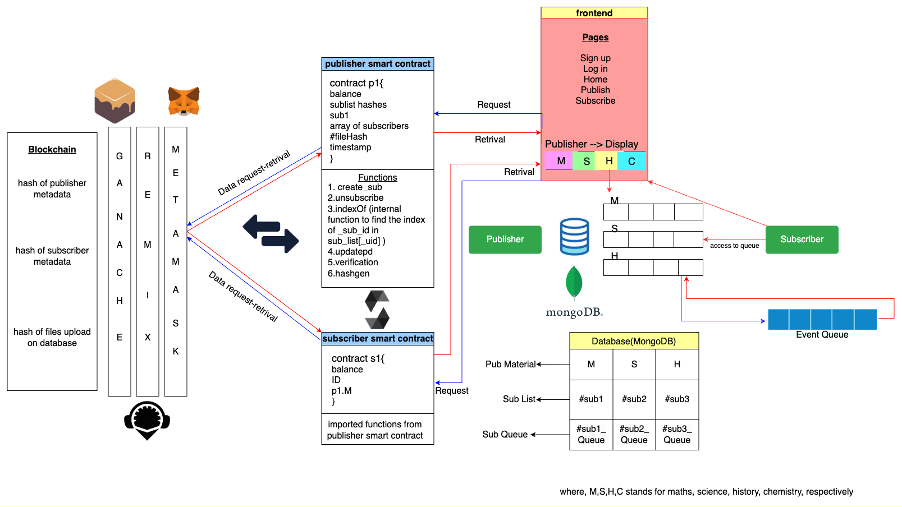
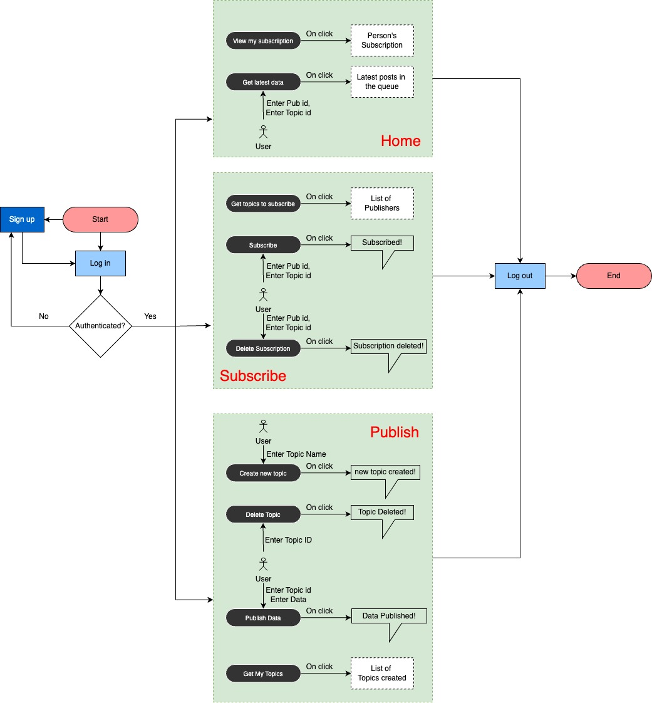

# Pre-Requisites

1. Install [MongoDB Compass](https://www.mongodb.com/try/download/community)
2. Install [Ganache](https://www.trufflesuite.com/ganache)
    - Create a new workspace
    - Keep it aside for now; don't close it

3. Install MetaMask extension in Chrome.
    - Create an account
    - Enter inside
    - Enable the test network from settings
    - Add a new network manually:
        - Network name: ganache_local_network
        - New RPC URL: http://127.0.0.1:7545
        - Chain ID: 1337
        - Currency symbol: GAN
        - Click save
        - Switch to the Ganache network

4. Import accounts into MetaMask
    - Click the circle above
    - Import account
    - Go to the Ganache app
    - Click on the key symbol on the right
    - Copy the private key
    - Paste it in MetaMask
    - Repeat the steps if you want to add more accounts
    - If you are still facing issues, please follow the [link](https://www.youtube.com/watch?v=lv4HEyiw4EQ&t=149s&pp=ygUWYWRkIGdhbmNoZSBpbiBtZXRhbWFzaw%3D%3D)

5. Deploy contract
    - Download the file from [GitHub](https://github.com/Lavany549/Publisher_Subscriber_Implementation/blob/main/publisher_subscriber_scheme_for_ethereum_smart_contracts.zip)
    - Extract and go to `src/contracts/pubsub.sol` and copy the `pubsub.sol`.
    - Go to Remix site (https://remix.ethereum.org/)
    - Open a new file, name it as `pubsub.sol`, and paste the code.
    - Save it, compile it.
    - Before deployment, change the environment to injected provider - Ganache Provider and change Ganache JSON-RPC Endpoint: http://127.0.0.1:7545
    - Deploy it

###VERY IMPORTANT NOTES:
For the 1st time you are running with a new account added in the MetaMask, you will be prompted to add/link the account included in MetaMask to the local file. Select all the accounts; otherwise, you can't use them. Every time you run a Solidity code from React JS side, you will have to approve the contract. MetaMask will automatically pop up.


## Setting Up the Environment

 6. Install Node.js and NPM

-If you haven't already installed Node.js and NPM, open your terminal or command prompt and run the following command to install the create-react-app tool globally:

```bash
npm install -g create-react-app
```
-Once the installation is complete, navigate to the directory where you want to create your new React app.
-Run the following command to create a new React app:
	```bash create-react-app publisher_subscriber_scheme_for_ethereum_smart_contracts```	
	note: npm naming restrictions name can no longer contain capital letters
	
7. ```bash cd publisher_subscriber_scheme_for_ethereum_smart_contracts ```

8.In step 5, downloaded file from git  need to extract and  replace with src folder and package.json file in the current folder.

9.npm install

10.In the code files...
    -go to the compile page of remix of pubsub.sol 
    -copy the ABI code of the pubsub.sol file... there is a button in the last of the compile tab
    -paste it in the abi variable in the pubsub.js file in src/contracts
    -after deploying it, copy the deployment address and paste it in the addr variable in the pubsub.js file in src/contracts
    save all.
12.Open mongoDB and connect to your localhost.
11.Open 3 different terminals in current location
	-terminal_1: cd .\src\DB\
		    mongod --dbpath ./
	-terminal_2: nodemon .\src\backend\back.js
	-terminal_3: npm start

YOU ARE GOOD TO GO

The flow of app ans architecture is as follows:




